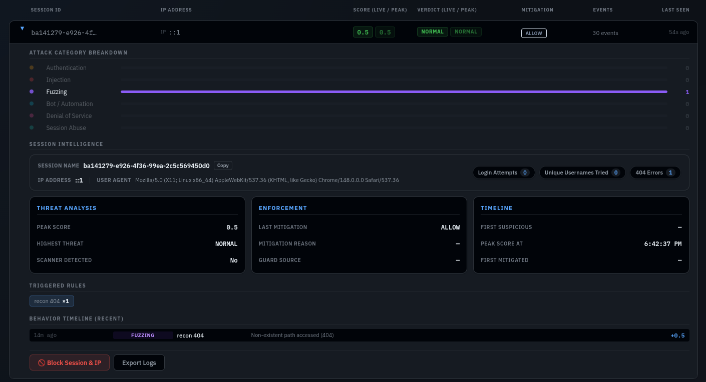

<a id="sideris"></a>

<p align="center">
  
</p>

<p align="center">
  <a href="#about"></a>&nbsp;
  <a href="#in-action"></a>&nbsp;
  <a href="#how-it-works"></a>&nbsp;
  <a href="#quick-start"></a>&nbsp;
  <a href="#configuration"></a>&nbsp;
  <a href="#contact"></a>
</p>

<p align="center">
  <a href="https://github.com/Ann-BT/SIDERIS/stargazers"></a>
</p>

<div align="center">
  <code>Node.js</code> • <code>React</code> • <code>Redis</code> • <code>PostgreSQL</code> • <code>Docker</code>
</div>


<br>

<div align="center">

### Your website is being probed right now. Bots, scrapers, credential stuffers — they don't knock.
### SIDERIS answers the door for you. With a baseball bat.

*⭐ If SIDERIS saved your server from a bad day, the star button is right up there. I run on dopamine and instant ramen.*

*💡 Click any section header badge to return to the top navigation.*

</div>

<br>
<p align="center">━━━━━━━ ❖ ━━━━━━━</p>

<a id="about"></a>
<br>
<p align="center">
  <a href="#sideris"></a>
</p>
<br>

**The problem:** You built a website. Somewhere between launching it and now, bots started hammering your login page, scrapers are stealing your content, and someone in Eastern Europe is fuzzing your endpoints at 3 AM. Your application has no idea any of this is happening.

**The solution:** SIDERIS — a **real-time WAF (Web Application Firewall) and behavioral analysis proxy** that sits in front of your website like a suspicious bouncer who has seen too much.

It intercepts every visitor, silently watches how they behave (typing speed, mouse movement, browser fingerprint, request patterns), builds a live threat score, and when that score gets ugly — it acts. Rate-limits, CAPTCHA challenges, or a hard block, automatically, before the bad traffic ever touches your actual server.

| Without SIDERIS (Chaos) | With SIDERIS (Order) |
|:---|:---|
| Bot &rarr; `[YOUR SERVER]` | Bot &rarr; `[SIDERIS]` &rarr; ✋ *"I don't think so."* |
| Scraper &rarr; `[YOUR SERVER]` | Scraper &rarr; `[SIDERIS]` &rarr; 🤔 *CAPTCHA challenge* |
| Human &rarr; `[YOUR SERVER]` | Human &rarr; `[SIDERIS]` &rarr; ✅ `[YOUR SERVER]` |
| Attacker &rarr; `[YOUR SERVER]` | Attacker &rarr; `[SIDERIS]` &rarr; 🚫 *Banned* |


**The best part:** You don't change a single line of your application code. SIDERIS is a sidecar — it runs alongside your existing website, whatever stack it's on.

<br>

### What makes SIDERIS different from a normal WAF?

Most WAFs check requests against a list of known bad patterns (signatures). Smart attackers just... don't use those patterns. SIDERIS watches *behavior* instead — how a real human types vs. how a bot fills forms, whether a session looks organic or scripted, whether the browser environment makes sense. You can't fake being human when something is measuring how you move your mouse.

<br>

### Works with literally anything

| Your stack | Does SIDERIS work? |
|:---|:---|
| WordPress | ✅ Yes |
| Laravel / PHP | ✅ Yes |
| Node.js / Express | ✅ Yes |
| Django / Flask | ✅ Yes |
| Static HTML | ✅ Yes |
| Something weird you built in 2011 | ✅ Probably yes |

If it serves HTTP, SIDERIS can protect it. No plugins. No code changes. No rearchitecting anything.

<br>
<p align="center">━━━━━━━ ❖ ━━━━━━━</p>

<a id="in-action"></a>
<br>
<p align="center">
  <a href="#sideris"></a>
</p>
<br>

> These are real screenshots from a running SIDERIS instance. No Figma files, no placeholder text, no lies.

<br>

### SIDERIS in Action: Features

Here are the key features of SIDERIS, showing the active dashboard screens and defensive mechanisms in action:

#### Transparent Telemetry Injection
<p align="center">
  
</p>

* **What it is:** A completely zero-touch tracking system. SIDERIS intercepts outgoing HTML on the fly and silently injects a small behavioral agent (`agent.js`) into the page context.
* **What it does to help:** It tracks mouse paths, keystrokes, and browser quirks from your visitors without you ever editing a single line of your actual storefront or application code.
* **Funny comment:** It is like having a private investigator watch every visitor from the bushes, except it's completely legal and doesn't get tired.

<br>

#### Central SOC Dashboard
<p align="center">
  
</p>

* **What it is:** The central flight deck and command center of your WAF.
* **What it does to help:** Aggregates real-time event logs, active connections, threat intelligence, and current defensive blocks into one premium single-page application.
* **Funny comment:** Perfect for keeping open on a second monitor to look busy when your boss walks past. It screams "cybersecurity wizard" even if you are just eating chips.

<br>

#### Live Sessions Monitor
<p align="center">
  
</p>

* **What it is:** A real-time traffic grid updating live as visitors move across your server.
* **What it does to help:** Color-codes every session by danger level. Green means a normal human typing away; red means an aggressive script hammering endpoints.
* **Funny comment:** Watch the bot trying to find `/wp-admin` on your React application and giggle as its threat score slowly turns a warning crimson.

<br>

#### Session Detail Deep Dive
<p align="center">
  
</p>

* **What it is:** A detailed forensic examiner for any specific user's timeline.
* **What it does to help:** Lists the exact WAF correlation rules they tripped, their raw keystroke timings, mouse heatmaps, and provides a big red manual ban button.
* **Funny comment:** For those special moments when automatic filtering is too polite, and you want to personally ban an annoying user yourself. Pure admin satisfaction.

<br>

#### Adaptive CAPTCHA Challenge
<p align="center">
  
</p>

* **What it is:** An automatic speed bump for suspicious but unconfirmed visitors.
* **What it does to help:** Blocks questionable requests and serves a CAPTCHA. Humans solve it in 2 seconds and get their connection restored; automated scrapers get stuck here forever.
* **Funny comment:** The digital equivalent of asking a suspected vampire to cross a line of salt. If they're a robot, they will sit there contemplating the universe until their server timeout hits.

<br>

#### Hard Block Screen
<p align="center">
  
</p>

* **What it is:** The final boundary for high-threat bots or manually blacklisted IPs.
* **What it does to help:** SIDERIS immediately cuts the TCP connection at the proxy layer, serving a strict block page. The malicious request never hits your Node/Python/PHP backend.
* **Funny comment:** Basically a digital door slammed right in the face. Zero CPU cycles wasted on your application server, zero databases queried. Goodbye.

<br>

#### Active Defense Matrix
<p align="center">
  
</p>

* **What it is:** A live directory of all active rate-limits, CAPTCHAs, and bans stored in Redis.
* **What it does to help:** Displays all current security enforcements and allows admins to lift bans instantly with one click if someone complains.
* **Funny comment:** Your virtual detention center. You can see who is currently in timeout, and you can grant parole if you're feeling generous (though they'll probably try to scrape you again).

<br>

#### Top Offenders Leaderboard
<p align="center">
  
</p>

* **What it is:** A ranked scoreboard of the most aggressive attacker subnets.
* **What it does to help:** Highlights persistent threat actors so you can block entire IP ranges at your cloud provider/DNS level if needed.
* **Funny comment:** The SIDERIS Hall of Shame. A ranked leaderboard of the script-kiddies who tried their hardest, got nowhere, and now have their IPs permanently memorialized.

<br>

#### Event Summary Metrics
<p align="center">
  
</p>

* **What it is:** A clean dashboard widget compiling recent event counts and active block percentages.
* **What it does to help:** Gives you rapid KPIs to measure how hard your server is being hit and how many attacks SIDERIS deflected.
* **Funny comment:** The "why you pay me" metric panel. Copy and paste this chart directly into your monthly report to justify your IT budget.

<br>

#### Historical Session Database
<p align="center">
  
</p>

* **What it is:** A structured PostgreSQL archive of historical connections.
* **What it does to help:** Saves session audits so you can search, query, and dissect past traffic anomalies long after they have disconnected.
* **Funny comment:** A permanent record of every bad actor who ever knocked on your port. Because security issues are best analyzed in hindsight with a cup of coffee.

<br>

#### Live Multi-Service Logs Console
<p align="center">
  
</p>

* **What it is:** An integrated web terminal showing standard output streams from all SIDERIS docker containers.
* **What it does to help:** Eliminates the need to open five terminal tabs running `docker logs`; it aggregates ingest, detector, and proxy outputs in one clean panel.
* **Funny comment:** It looks like the Matrix falling code, except it actually tells you why your web server is throwing a 502 error instead of showing you kung-fu.

<br>

#### Dashboard Access Log
<p align="center">
  
</p>

* **What it is:** A self-auditing security panel log.
* **What it does to help:** Keeps track of every IP trying to access or log into your SIDERIS control panel.
* **Funny comment:** SIDERIS is so paranoid it doesn't even trust you. If you mistype your password, it will log your IP as a suspicious event just to be safe.

<br>

#### Appearance Theme Selector
<p align="center">
  
</p>

* **What it is:** A theme selection menu supporting Tokyo Night, Catppuccin, Nord, Dracula, and more.
* **What it does to help:** Customizes the WAF dashboard to match your personal preference or IDE colors.
* **Funny comment:** Because defending your web server from automated scrapers is serious business, but looking at a boring white dashboard while doing it is a crime.

<br>

#### Runtime Scoring Guide
<p align="center">
  
</p>

* **What it is:** An interactive documentation manual built directly into the dashboard.
* **What it does to help:** Explains the scoring heuristics, decay rates, and telemetry weightings so you can understand exactly why a threat level was assigned.
* **Funny comment:** For the rare times you actually want to read the math formulas instead of just trusting the red/green dots. Excellent bedtime reading.

<br>

<br>
<p align="center">━━━━━━━ ❖ ━━━━━━━</p>

<a id="how-it-works"></a>
<br>
<p align="center">
  <a href="#sideris"></a>
</p>
<br>

Think of SIDERIS as a bouncer who never sleeps, never gets bribed, and has a perfect memory.

Every visitor to your website goes through SIDERIS first. SIDERIS quietly injects a tiny JavaScript agent into the HTML it serves — invisible to the visitor, invisible to your app. That agent streams behavioral telemetry back in real time: how fast they type, how they move their mouse, whether they're using a real browser or impersonating one.

All of that feeds into a live scoring engine. The score is calculated continuously using `Impact × Confidence × Persistence` across 5 escalating enforcement tiers. When the score crosses a threshold, SIDERIS acts — automatically, without you having to do anything.

```
[ Visitor ]
    │
    ▼ (port 4000 — the only port your users ever see)
┌─────────────────────────────────┐
│         SIDERIS WAF PROXY       │
│  • Intercepts all HTTP traffic  │
│  • Injects agent.js into HTML   │
│  • Enforces active blocks       │
└──────────────┬──────────────────┘
               │                         ┌─────────────────────┐
               │ (forwards clean traffic) │   agent.js running  │
               ▼ (port 8080)             │   in visitor browser │
    [ Your Web Application ]             │   streams telemetry ↓│
    (unchanged, unaware, happy)          └──────────┬──────────┘
                                                    │
                                         (port 5000 — ingest)
                                                    │
                                                    ▼
                                         ┌─────────────────────┐
                                         │   Scoring Engine     │
                                         │   Redis (live state) │
                                         │   Guard Service      │
                                         └──────────┬──────────┘
                                                    │
                                         ┌──────────▼──────────┐
                                         │     PostgreSQL       │
                                         │   (event archive)    │
                                         └──────────┬──────────┘
                                                    │
                                         ┌──────────▼──────────┐
                                         │   SOC Dashboard      │
                                         │   (port 6001)        │
                                         │   your window into   │
                                         │   all of the above   │
                                         └─────────────────────┘
```

### The 5 Enforcement Tiers

When a session's threat score climbs, SIDERIS escalates proportionally — it doesn't jump straight to banning everyone who looks slightly suspicious:

| Tier | Trigger | Response |
|:---|:---|:---|
| **1 — Monitor** | Slightly elevated score | Watching. Taking notes. Saying nothing. |
| **2 — Flag** | Suspicious patterns forming | Logged, tagged, SOC alerted |
| **3 — Rate Limit** | Score confirms bad intent | Requests throttled heavily |
| **4 — Challenge** | High confidence threat | CAPTCHA served mid-session |
| **5 — Block** | Maximum threat / manual override | Connection terminated. Goodbye. |

<br>
<p align="center">━━━━━━━ ❖ ━━━━━━━</p>

<a id="quick-start"></a>
<br>
<p align="center">
  <a href="#sideris"></a>
</p>
<br>

You need: **Docker** and **Docker Compose**. That's it. No Node.js installation. No PostgreSQL setup. No Redis configuration. Docker handles the entire stack.

> [!IMPORTANT]
> SIDERIS runs as a sidecar in front of your existing website. Your website keeps running exactly as it is — you just point traffic through SIDERIS first.

<br>

### Step 1 — Clone

```bash
git clone https://github.com/Ann-BT/SIDERIS.git
cd SIDERIS
```

### Step 2 — Configure (30 seconds)

```bash
cp .env.example .env
```

Open `.env` and set two values:

```env
# Where is your existing website running?
TARGET_URL=http://localhost:8080

# What port should SIDERIS listen on? (your users will hit this)
PROXY_PORT=4000
```

Everything else has sensible defaults. You can tune it later.

### Step 3 — Launch

```bash
docker compose up -d --build
```

That's it. Your website is now at `http://your-server-ip:4000` and SIDERIS is watching.

The SOC dashboard comes up at `http://localhost:6001` — accessible from your machine only by default (see [Configuration](#configuration) to add more IPs).

<br>

### What just started?

```
sideris-proxy      → port 4000   (the WAF, faces the internet)
sideris-ingest     → port 5000   (receives agent.js telemetry)
sideris-dashboard  → port 6001   (your SOC panel)
sideris-redis      → internal    (live session state)
sideris-postgres   → internal    (event archive)
```

All five services talk to each other over an internal Docker network. Nothing except ports 4000, 5000, and 6001 are exposed.

<br>

> [!TIP]
> **Production deployment**: Put Nginx or Cloudflare in front of SIDERIS on ports 80/443 for SSL. SIDERIS handles the security logic; let your reverse proxy handle TLS termination.

<br>
<p align="center">━━━━━━━ ❖ ━━━━━━━</p>

<a id="configuration"></a>
<br>
<p align="center">
  <a href="#sideris"></a>
</p>
<br>

All configuration lives in `.env`. Here's what every variable does:

| Variable | Default | What it does |
|:---|:---|:---|
| `TARGET_URL` | `http://localhost:8080` | Your actual website. SIDERIS forwards clean traffic here. |
| `PROXY_PORT` | `4000` | The public-facing port. This is what your users connect to. |
| `INGEST_PORT` | `5000` | Where `agent.js` sends behavioral telemetry. Keep internal. |
| `DASHBOARD_PORT` | `6001` | SOC dashboard port. Do not expose to the internet. |
| `REDIS_URL` | `redis://redis:6379` | Live session state. Docker handles this automatically. |
| `POSTGRES_URL` | `postgresql://sideris:...` | Event archive. Docker handles this automatically. |
| `DASHBOARD_ALLOWED_IPS` | `127.0.0.1,::1` | Comma-separated list of IPs that can open the SOC dashboard. Add your own IP here. |

<br>

**To allow your IP on the dashboard:**
```env
DASHBOARD_ALLOWED_IPS=127.0.0.1,::1,YOUR.IP.ADDRESS.HERE
```

**To protect a remote server:**
```env
TARGET_URL=http://localhost:8080   # your app still runs locally on the server
PROXY_PORT=80                      # SIDERIS takes port 80 directly
```

For advanced configuration, native (non-Docker) setup, and scoring threshold tuning, see the **[Deployment and Configuration Guide](./DEPLOYMENT.md)**.

<br>
<p align="center">━━━━━━━ ❖ ━━━━━━━</p>

<a id="contact"></a>
<br>
<p align="center">
  <a href="#sideris"></a>
</p>
<br>

Found a bug? Have a feature idea? Want to tell me SIDERIS saved your server? Want to tell me SIDERIS broke your server? Either way, reach out:

- **Email**: [anbt.personal@gmail.com](mailto:anbt.personal@gmail.com)
- **Facebook**: [Ann-BT / Merlin the Great Mage](https://www.facebook.com/merlinthegreatmage)
- **GitHub Issues**: For bugs and feature requests, open an issue — that's what they're for.

<br>
<p align="center">━━━━━━━ ❖ ━━━━━━━</p>

<a id="license"></a>
<br>
<p align="center">
  <a href="#sideris"></a>
</p>
<br>

SIDERIS is open-source software licensed under the **[MIT License](./LICENSE)**.

Free to use, modify, and deploy — personal projects, commercial websites, whatever. The only thing you can't do is sue me if a sufficiently determined attacker gets through anyway. Security is a process, not a product. SIDERIS just makes the process considerably less painful.

<br>

---

<div align="center">
  <br>
  <i>Built with too much coffee and genuine paranoia about web security.</i>
  <br><br>
  <a href="https://github.com/Ann-BT/SIDERIS/stargazers"></a>
  <br><br>
  <i>⭐ Stars are free and they make me unreasonably happy. Just saying.</i>
</div>
