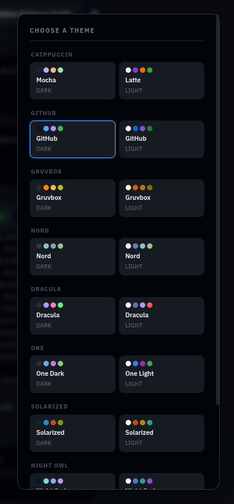

<a id="sideris"></a>

<p align="center">
  
</p>

<p align="center">
  <a href="#what-is-sideris"></a>&nbsp;
  <a href="#how-it-works"></a>&nbsp;
  <a href="#performance"></a>&nbsp;
  <a href="#in-action"></a>&nbsp;
  <a href="#quick-start"></a>&nbsp;
  <a href="#limitations"></a>&nbsp;
  <a href="#configuration"></a>
</p>

<p align="center">
  
  
  
  
  
  
</p>

<br>

<div align="center">

# SIDERIS
### Behavioral WAF & Real-Time Threat Detection Proxy

*A sidecar security layer that intercepts, analyzes, and neutralizes malicious traffic — without touching a single line of your application code.*

</div>

<br>
<p align="center">━━━━━━━ ❖ ━━━━━━━</p>

<a id="what-is-sideris"></a>
<br>

## What Is SIDERIS?

SIDERIS is a **self-hosted Web Application Firewall and behavioral analysis proxy** that runs in front of your existing website. It requires no changes to your application and works with any stack — WordPress, Laravel, Node.js, Django, static HTML, or that thing you built in 2011 and are too scared to touch.

It works by sitting between your users and your server, silently watching *how* visitors behave — not just *what* they request. Keystroke dynamics, mouse movement patterns, request timing, browser fingerprinting. When the behavior looks automated, SIDERIS acts. When it looks human, traffic passes through untouched.

<br>

### The problem SIDERIS solves

Your application is being probed right now. Credential stuffers, content scrapers, endpoint fuzzers — most of them don't trigger traditional WAF signatures because they don't use known payloads. They just behave differently from humans. SIDERIS measures that difference.

| Threat Type | Traditional WAF | SIDERIS |
|:---|:---:|:---:|
| Known attack signatures (SQLi, XSS) | ✅ | ✅ |
| Behavioral anomalies (bots, scrapers) | ❌ | ✅ |
| Credential stuffing | ❌ | ✅ |
| Headless browser automation | ❌ | ✅ |
| Human users | ✅ pass | ✅ pass |

<br>

### Zero application changes required

SIDERIS is a sidecar. Your application keeps running exactly as-is. You point traffic through SIDERIS first. That's the entire integration.

```
Before:  [Users] ──────────────────────── [Your App]
After:   [Users] ── [SIDERIS :4000] ───── [Your App :8080]
```

| Stack | Compatible |
|:---|:---:|
| WordPress / WooCommerce | ✅ |
| Laravel / PHP | ✅ |
| Node.js / Express | ✅ |
| Django / Flask | ✅ |
| Ruby on Rails | ✅ |
| Static HTML / CDN origin | ✅ |
| Anything that speaks HTTP | ✅ |

<br>
<p align="center">━━━━━━━ ❖ ━━━━━━━</p>

<a id="how-it-works"></a>
<br>

## Architecture

SIDERIS runs as three Docker containers: `sideris-redis` for live state, `sideris-postgres` for event archiving, and `sideris-app` which houses the core microservices (proxy, telemetry ingest, decision engine, and SOC dashboard) running concurrently. The application container runs on host network mode to easily proxy local targets.

```
[ Visitor Browser ]
        │
        ▼ :4000  (the only port your users ever see)
┌───────────────────────────────────────┐
│           SIDERIS WAF PROXY           │
│  • Enforces active blocks / rate-     │
│    limits before forwarding           │
│  • Injects agent.js into HTML         │
│  • Strips agent.js from static assets │
└──────────────┬────────────────────────┘
               │ clean traffic only
               ▼ :8080
    [ Your Web Application ]
    (untouched, unaware, unbothered)

               ┌──────────────────────────────┐
               │    agent.js (in browser)      │
               │  Collects:                    │
               │  • Keystroke timing           │
               │  • Mouse movement patterns    │
               │  • Browser fingerprint        │
               │  • Request cadence            │
               └──────────────┬───────────────┘
                              │ telemetry stream
                              ▼ :5000
               ┌──────────────────────────────┐
               │       INGEST COLLECTOR        │
               │  Validates & routes events    │
               │  to Redis Streams             │
               └──────────────┬───────────────┘
                              │
                              ▼
               ┌──────────────────────────────┐
               │  SCORING ENGINE + GUARD       │
               │                              │
               │  Score = Impact × Confidence │
               │          × Persistence       │
               │                              │
               │  Tier 1 → Monitor (Allow)    │
               │  Tier 2 → Rate Limit         │
               │  Tier 3 → CAPTCHA Challenge  │
               │  Tier 4 → Soft Block         │
               │  Tier 5 → Hard Block         │
               │                              │
               │  State: Redis (live)         │
               │  Archive: PostgreSQL         │
               └──────────────┬───────────────┘
                              │
                              ▼ :6001 (API) / :5173 (UI)
               ┌──────────────────────────────┐
               │       SOC DASHBOARD           │
               │  Real-time session monitor   │
               │  Threat management console   │
               │  IP-allowlist gated access   │
               └──────────────────────────────┘
```

### The scoring model

Every session accumulates a threat score calculated as:

```
Score = Impact × Confidence × Persistence
```

- **Impact** — severity of the detected behavior (probing endpoints vs. passive scraping)
- **Confidence** — how certain the system is this isn't a false positive
- **Persistence** — how long and consistently the behavior has continued

Scores map to five enforcement tiers. Lower tiers log and monitor; upper tiers challenge or block. The system decays scores over time — a visitor who triggered rate limiting and then behaved normally will eventually recover to clean status.

### What MITRE ATT&CK techniques does SIDERIS detect?

SIDERIS correlation rules are mapped to ATT&CK for Enterprise:

| Technique | ATT&CK ID | Detection Method |
|:---|:---|:---|
| Automated credential stuffing | T1110.004 | Request cadence + form fill timing |
| Web scraping / content theft | T1119 | Navigation pattern + request volume |
| Vulnerability scanning | T1595.002 | Endpoint fuzzing signature + timing |
| Browser fingerprint spoofing | T1592 | Environment inconsistency detection |
| Headless browser automation | T1059.007 | Behavioral biometrics deviation |

### Scalability & Resiliency

SIDERIS is built to scale horizontally and survive backend dependency failures:

- **Horizontal Scaling:** State is centralized in Redis, allowing you to run multiple instances of the WAF Proxy behind a load balancer (like Nginx, HAProxy, or Cloudflare). The Detector Worker uses a Redis Consumer Group (`sideris_group`) to load-balance telemetry scoring events across multiple worker processes.
- **Fail-Open Safe Mode:** If the Redis container goes down or encounters network lag, the WAF Proxy automatically catches the connection error, logs it, and falls back to passing traffic directly to your application backend. Your website stays online and accessible, even if your security telemetry services fail.

<br>
<p align="center">━━━━━━━ ❖ ━━━━━━━</p>

<a id="performance"></a>
<br>

## Performance & Overhead

This is the section most security tools skip. We don't.

### Latency overhead

SIDERIS adds a proxy hop between your users and your application. In testing against a local target (OWASP Juice Shop):

| Condition | Added Latency |
|:---|:---|
| Clean request, session exists in Redis | ~2–4ms |
| First request, new session (cold lookup) | ~8–12ms |
| Blocked session (dropped at proxy) | <1ms (never reaches app) |

These numbers are from a single-machine Docker setup. In production with Redis on fast hardware, cold lookup overhead is lower. Network latency between your reverse proxy and SIDERIS will dominate if they're on separate hosts.

> **Recommendation:** Run SIDERIS on the same host as your application, or on the same local network. Do not route traffic across data centers.

### Memory footprint

| Service | Idle RAM |
|:---|:---|
| sideris-proxy | ~60MB |
| sideris-ingest | ~50MB |
| sideris-dashboard | ~80MB |
| Redis | ~30MB (grows with active sessions) |
| PostgreSQL | ~90MB |
| **Total** | **~310MB** |

A VPS with 1GB RAM is sufficient for low-to-medium traffic sites. For high-traffic deployments, a 2GB instance with Redis maxmemory set is recommended.

### Session capacity

Redis holds live session state. Default configuration supports approximately 10,000 concurrent tracked sessions before memory pressure becomes a factor. This is tunable — see [Configuration](#configuration).

<br>

> [!WARNING]
> SIDERIS is a proxy. Like all proxies, it is a single point of failure if not deployed with redundancy. For production, run it behind a load balancer or deploy multiple instances. See [Deployment Guide](./DEPLOYMENT.md) for HA setup.

<br>
<p align="center">━━━━━━━ ❖ ━━━━━━━</p>

<a id="in-action"></a>
<br>

## Interface Walkthrough

Here is a walkthrough of the SIDERIS interface, starting with the full dashboard overview, followed by its sections ordered from the top of the screen to the bottom, and finally the client-side injection and security intercept screens.

<br>

#### 1. SOC Dashboard — Main View
<p align="center">
  
</p>

The central cockpit and primary control room of SIDERIS. It aggregates active visitor counts, real-time threat scores, active block percentages, and live telemetry feeds into a single unified workspace—perfect for leaving open on a second monitor to look busy when your boss walks past.

<br>

#### 2. Theme Selector
<p align="center">
  
</p>

Located in the top header. Change color schemes on the fly between Tokyo Night, Catppuccin, Nord, and Dracula. Because defending your database from automated scrapers is serious business, but doing it in an ugly default layout is a tragedy.

<br>

#### 3. Scoring & Rules Reference
<p align="center">
  
</p>

Accessed from the top header navigation. This is an interactive manual explaining the WAF's threat equations, correlation rules, and decay math—perfect bedtime reading for when you want to study the exact logic of the heuristic engine.

<br>

#### 4. Event Summary Metrics
<p align="center">
  
</p>

Sitting in the top row of the dashboard canvas. A high-level KPI widget showing today's deflected attacks and active blocks. It's the ultimate chart to copy-paste into your monthly report to justify your cybersecurity budget and existence.

<br>

#### 5. Top Offenders
<p align="center">
  
</p>

Positioned in the upper-right dashboard grid. The SIDERIS Hall of Shame. A ranked leaderboard of the most aggressive attacker subnets and scrapers that tried their best, got blocked immediately, and now have their IPs permanently memorialized.

<br>

#### 6. Dashboard Access Audit Log
<p align="center">
  
</p>

Placed in the upper metrics row. A strict self-audit panel logging every dashboard log-in attempt. SIDERIS is so paranoid it doesn't even trust you, meaning if you mistype your admin credentials, you will log yourself as a threat.

<br>

#### 7. Live Sessions Table
<p align="center">
  
</p>

The main central table of the dashboard. A real-time grid tracking every active visitor. It color-codes sessions by risk level (green is human, red is script) so you can watch scrapers trying to brute-force your pages and giggle as their threat scores spike.

<br>

#### 8. Session Detail View
<p align="center">
  
</p>

Opened by expanding any row in the center grid. The forensic investigator panel. Expand any active user to inspect their triggered correlation rules, keystroke timings, and mouse heatmaps—complete with a massive manual ban button for when automated filtering isn't satisfying enough.

<br>

#### 9. Active Defense Registry
<p align="center">
  
</p>

Located near the bottom half of the dashboard. A live registry of every active ban, rate-limit, and CAPTCHA challenge currently registered in Redis. If a real user accidentally gets flagged, you can grant them parole with a single click.

<br>

#### 10. Unified Log Console
<p align="center">
  
</p>

Embedded at the bottom of the dashboard. An integrated console combining stdout logs from your proxy, ingest, and detector containers. It looks like the Matrix code, except it actually contains useful information instead of green rain.

<br>

#### 11. Transparent Agent Injection
<p align="center">
  
</p>

Behind the scenes at the client storefront. SIDERIS intercepts outgoing HTML on the fly to silently inject a tiny tracking agent (`agent.js`) into the page context. It maps mouse movements and keystroke dynamics in the shadows, tracking user behavior without you changing a single line of application code. It's like having a private investigator watch every visitor from the bushes, except it's completely legal and doesn't get tired.

<br>

#### 12. CAPTCHA Challenge
<p align="center">
  
</p>

The security gate served directly to visitors in their browser. Suspected bots get hit with a CAPTCHA mid-session, trapping automated scrapers in an infinite loop of identifying traffic lights while actual humans pass right through.

<br>

#### 13. Hard Block Screen
<p align="center">
  
</p>

The block page shown to banned visitors. Confirmed threat actors get their TCP connections dropped at the proxy level before they ever touch your actual application server, saving your CPU cycles and database from useless queries.

<br>
<p align="center">━━━━━━━ ❖ ━━━━━━━</p>

<a id="quick-start"></a>
<br>

## Quick Start

**Prerequisites:** Docker and Docker Compose. Nothing else needs to be installed on your host.

> [!IMPORTANT]
> SIDERIS runs as a sidecar in front of your existing application. Your application keeps running on its current port. SIDERIS takes the public-facing port.

<br>

### Step 1 — Clone

```bash
git clone https://github.com/Ann-BT/SIDERIS.git
cd SIDERIS
```

### Step 2 — Configure

```bash
cp .env.example .env
```

Edit `.env` and set these two values:

```env
# Where your application is currently running
TARGET_URL=http://localhost:8080

# The public port SIDERIS will listen on (your users hit this)
PROXY_PORT=4000
```

Everything else has safe defaults. You can tune thresholds after you see your traffic patterns.

### Step 3 — Launch

```bash
docker compose up -d --build
```

Your application is now protected at `http://your-server:4000`.  
SOC dashboard: `http://localhost:5173` (localhost-only by default).

<br>

### What's running

```
sideris-app (Proxy)     :4000   WAF proxy — public-facing
sideris-app (Ingest)    :5000   Telemetry receiver — keep internal
sideris-app (SOC API)   :6001   Dashboard API — keep internal
sideris-app (SOC UI)    :5173   SOC Dashboard UI — keep internal
sideris-redis           internal
sideris-postgres        internal
```

All inter-service communication happens over an isolated Docker network. Only the ports you expose are reachable from outside.

<br>

### Recommended production setup

```
[Internet] → [Nginx / Cloudflare :443] → [SIDERIS :4000] → [Your App :8080]
```

Let your existing reverse proxy handle TLS termination. SIDERIS handles the security logic. They do different jobs and do them better when separated.

For full production deployment including HTTPS, high-availability, and scaling guidance: **[Deployment Guide](./DEPLOYMENT.md)**

<br>
<p align="center">━━━━━━━ ❖ ━━━━━━━</p>

<a id="limitations"></a>
<br>

## Honest Limitations

Every security tool has a threat model boundary. Here is SIDERIS's:

<br>

**SIDERIS is not a DDoS mitigation tool.**  
It is designed for behavioral analysis of individual sessions — not volumetric flood attacks. If you're receiving millions of requests per second, you need a CDN-level solution (Cloudflare, AWS Shield) upstream of SIDERIS, not instead of it.

**SIDERIS is not a network firewall.**  
It operates at the HTTP application layer. It does not inspect raw TCP/UDP traffic, provide IDS/IPS functionality, or replace `iptables` / `ufw` rules.

**Behavioral analysis requires a warm-up period.**  
On first deployment, SIDERIS has no baseline for what "normal" traffic on your site looks like. Scoring confidence increases as session history accumulates. Expect the first 24-48 hours to be conservative — the system will under-block rather than over-block while calibrating.

**False positives are possible.**  
Power users, accessibility tools, and some browser extensions can produce behavioral signals that resemble automation. Default thresholds are tuned to minimize this, but no behavioral system is perfect. The [Active Defense Registry](#9-active-defense-registry) panel lets you manually pardon affected users in seconds.

**SIDERIS is a single proxy process.**  
Without redundancy, it is a single point of failure. For mission-critical deployments, run multiple instances behind a load balancer. See [Deployment Guide](./DEPLOYMENT.md).

**agent.js requires JavaScript.**  
Behavioral telemetry collection depends on JavaScript running in the visitor's browser. Sessions with JavaScript disabled fall back to request-pattern analysis only. This covers the vast majority of real traffic but reduces detection confidence for JS-disabled clients.

<br>

> Security is a layered problem. SIDERIS is one layer — the behavioral detection layer. It works best alongside, not instead of, TLS, proper authentication, dependency patching, and infrastructure hardening.

<br>
<p align="center">━━━━━━━ ❖ ━━━━━━━</p>

<a id="configuration"></a>
<br>

## Configuration Reference

All configuration lives in `.env`.

| Variable | Default | Description |
|:---|:---|:---|
| `TARGET_URL` | `http://localhost:8080` | Your application's internal address. SIDERIS forwards clean traffic here. |
| `PROXY_PORT` | `4000` | Public-facing WAF port. Users connect here. |
| `INGEST_PORT` | `5000` | Telemetry receiver port. Keep this internal — do not expose to the internet. |
| `DASHBOARD_PORT` | `6001` | SOC dashboard API port. Keep internal. |
| `REDIS_URL` | `redis://redis:6379` | Live session state store. Docker manages this automatically. |
| `POSTGRES_URL` | `postgresql://sideris:...` | Event archive database. Docker manages this automatically. |
| `DASHBOARD_ALLOWED_IPS` | `127.0.0.1,::1` | Comma-separated list of IPs permitted to access the SOC dashboard. |

<br>

**Allow your IP on the dashboard:**
```env
DASHBOARD_ALLOWED_IPS=127.0.0.1,::1,203.0.113.42
```

**Take over port 80 on a VPS:**
```env
TARGET_URL=http://localhost:8080
PROXY_PORT=80
```

**Allow office network access to the dashboard:**
```env
DASHBOARD_ALLOWED_IPS=127.0.0.1,::1,192.168.1.0/24,203.0.113.0/24
```

For scoring threshold tuning, session TTL configuration, and advanced deployment options: **[Deployment and Configuration Guide](./DEPLOYMENT.md)**

<br>
<p align="center">━━━━━━━ ❖ ━━━━━━━</p>

<a id="faq"></a>
<br>

## FAQ

**Will SIDERIS slow down my website?**  
For most sites: negligibly. Clean requests on established sessions add ~2–4ms. Cold session lookups add ~8–12ms. Blocked sessions are dropped in under 1ms. See [Performance](#performance) for full numbers.

**What happens if SIDERIS goes down?**  
Traffic stops flowing to your application. This is a proxy — if the proxy dies, the connection dies. For production, run it behind a health-checked load balancer. See [Deployment Guide](./DEPLOYMENT.md).

**What happens if the Redis or PostgreSQL databases go down?**  
SIDERIS is configured to **fail open**. If the Redis cache encounters issues, the WAF Proxy catches the connection error, logs it, and falls back to routing traffic directly to your application without blocking users. Your site remains online, though security scoring will be paused until the database recovers.

**Will it block my legitimate users?**  
Occasionally possible, especially for power users or accessibility tool users. Default thresholds are conservative. Any blocked session can be pardoned from the SOC dashboard in seconds, and you can tune sensitivity in `.env`.

**Does it work with HTTPS?**  
SIDERIS terminates plain HTTP. Put Nginx or Caddy in front to handle TLS, then forward to SIDERIS. Standard reverse proxy pattern — nothing unusual.

**Does agent.js collect personal data?**  
It collects behavioral signals: keystroke timing intervals, mouse movement vectors, request patterns. It does not collect keystrokes themselves, form field content, or personally identifiable information. Review `agent.js` directly — it's in the repository.

**Can I run this on shared hosting?**  
No. SIDERIS requires Docker. You need a VPS or dedicated server.

<br>
<p align="center">━━━━━━━ ❖ ━━━━━━━</p>

<br>

## Get In Touch

Found a bug? Have a feature idea? Deployed this on a real site and want to share what you found?

- **GitHub Issues** — bugs, feature requests, reproducible problems
- **Email** — [anbt.personal@gmail.com](mailto:anbt.personal@gmail.com)

<br>

---

<div align="center">

**SIDERIS** is open-source, MIT licensed. Free to use, modify, and deploy — personal projects, commercial sites, whatever.

The only thing the license doesn't cover is holding us responsible if a sufficiently motivated attacker gets through anyway. Security is a process. SIDERIS is one layer of it.

<br>

<a href="https://github.com/Ann-BT/SIDERIS/stargazers"></a>

<br>

*Built with genuine paranoia about web security and an unhealthy relationship with Redis Streams.*

</div>
