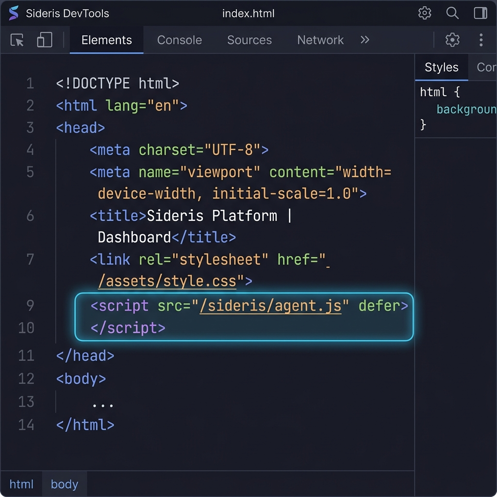

<a id="sideris"></a>
<p align="center">
  
</p>

<p align="center">
  <a href="#about"></a>&nbsp;
  <a href="#quick-start"></a>&nbsp;
  <a href="#architecture"></a>&nbsp;
  <a href="#gallery"></a>&nbsp;
  <a href="#configuration"></a>&nbsp;
  <a href="#contact"></a>&nbsp;
  <a href="#license"></a>
</p>

<p align="center">
  <a href="https://github.com/Ann-BT/SIDERIS/stargazers"></a>&nbsp;
  <a href="https://github.com/Ann-BT/SIDERIS"></a>
</p>

<div align="center">
<pre>
<a href="#about">ᴀʙᴏᴜᴛ</a>  •  <a href="#quick-start">ǫᴜɪᴄᴋ sᴛᴀʀᴛ</a>  •  <a href="#architecture">ᴀʀᴄʜɪᴛᴇᴄᴛᴜʀᴇ</a>  •  <a href="#gallery">ɢᴀʟʟᴇʀʏ</a>  •  <a href="#configuration">ᴄᴏɴꜰɪɢᴜʀᴀᴛɪᴏɴ</a>  •  <a href="#contact">ᴄᴏɴᴛᴀᴄᴛ</a>  •  <a href="#license">ʟɪᴄᴇɴsᴇ</a>
</pre>
</div>

<br>

<div align="center">
  <h3>🛡️ If SIDERIS helps protect your website, please support the project by leaving a Star! 🛡️</h3>
  <i>💡 Tip: Click any section header badge or the "Back to Top" buttons to return to the top navigation.</i>
</div>

<br>

<a id="about"></a>
<br>
<p align="center">
  <a href="#sideris"></a>
</p>
<br>

SIDERIS (Sidecar Integrated Detection, Event Reporting, and Intelligence System) is a real-time web application firewall (WAF) and client-side behavioral analysis proxy. 

SIDERIS sits in front of your website like a reverse proxy with severe trust issues. It intercepts user traffic, automatically injects a client-side telemetry agent into served HTML, statefully scores user behavior in real time, and dynamically enforces progressive defenses (like rate-limiting, CAPTCHAs, or IP blocks) when risk thresholds are crossed.

Because hoping your users will play nice is not a security strategy.

---

### Why Webmasters Choose SIDERIS

* **Works With Any Stack**: Whether your website is built on WordPress, PHP, Laravel, Node.js, Python, Ruby, or is just static HTML, SIDERIS runs as a standalone sidecar.
* **Zero Application Code Changes**: You do not need to install plugins or rewrite a single line of backend database or application code.
* **Protects Against Zero-Days**: By statefully monitoring behavioral telemetry (such as typing patterns, mouse tracking, and browser environment signals) rather than relying only on signature databases, it stops sophisticated bots and manual attacks that bypass traditional WAFs.

---

> [!IMPORTANT]
> SIDERIS operates transparently. Simply run SIDERIS in front of your website server and point your public traffic to it.

<br>
<p align="right"><a href="#sideris"></a></p>
<p align="center">━━━━━━━ ❖ ━━━━━━━</p>

<a id="quick-start"></a>
<br>
<p align="center">
  <a href="#sideris"></a>
</p>
<br>

To deploy SIDERIS in front of your website right now:

### 1. Download SIDERIS
```bash
git clone https://github.com/Ann-BT/SIDERIS.git
cd SIDERIS
```

### 2. Configure Environment
Create your config file:
```bash
cp .env.example .env
```
Open `.env` in a text editor and update:
* `TARGET_URL`: Point this to your existing website (e.g., `http://localhost:8080`).
* `PROXY_PORT`: The public port where users will now access your site through SIDERIS (default `4000`).

### 3. Run SIDERIS
```bash
docker compose up -d --build
```

Access your website at `http://your-server-ip:4000`. You are now protected.

<br>
<p align="right"><a href="#sideris"></a></p>
<p align="center">━━━━━━━ ❖ ━━━━━━━</p>

<a id="architecture"></a>
<br>
<p align="center">
  <a href="#sideris"></a>
</p>
<br>

SIDERIS acts as a protective shield between public traffic and your real web application server:

```
                      [ Public Internet ]
                              │
                              ▼ (Ports 80/443)
                      [ Reverse Proxy / SSL ]
                      (e.g., Nginx, Cloudflare)
                              │
                              ▼ (Port 4000)
                      ┌───────────────────────┐
                      │    SIDERIS WAF PROXY  │ ◄── [ Injects agent.js ]
                      └──────────┬────────────┘
                                 │
                                 ▼ (Port 8080 / Localhost)
                       [ Your Web Application ]
                       (WordPress, Node.js, PHP)
```

1. **User traffic** hits the WAF Proxy first.
2. SIDERIS intercepts the HTML responses and automatically injects the telemetry agent (`agent.js`) into the browser.
3. The browser agent streams client-side behavior telemetry (typing speeds, mouse tracking, autofill) back to the ingestion endpoint (`:5000`).
4. Telemetry is streamed into **Redis** for real-time scoring.
5. High-risk actions trigger the **Guard Service** to apply mitigations (rate-limiting, challenges) immediately.
6. Persistent logs and security events are archived in **PostgreSQL** for analysis on the React-based **SOC Dashboard** (`:5173`).

<br>
<p align="right"><a href="#sideris"></a></p>
<p align="center">━━━━━━━ ❖ ━━━━━━━</p>

<a id="gallery"></a>
<br>
<p align="center">
  <a href="#sideris"></a>
</p>
<br>

<table>
  <tr>
    <td width="50%" align="center" valign="top">
      <b>1. Automatic Telemetry Injection</b><br>
      <i>The WAF reverse proxy intercepts traffic and injects <code>agent.js</code> seamlessly without site modifications.</i>
      <br><br>
      
    </td>
    <td width="50%" align="center" valign="top">
      <b>2. Adaptive CAPTCHA Challenge</b><br>
      <i>Suspicious sessions trigger a server-generated captcha overlay to verify human presence.</i>
      <br><br>
      
    </td>
  </tr>
  <tr>
    <td width="50%" align="center" valign="top">
      <b>3. Hard Block Screen</b><br>
      <i>Malicious request patterns or manual blocks result in an immediate proxy level connection lockout.</i>
      <br><br>
      
    </td>
    <td width="50%" align="center" valign="top">
      <b>4. SOC Dashboard Live Streams</b><br>
      <i>The React interface aggregates live sessions, color-coded risk indexes, and active connection metadata.</i>
      <br><br>
      
    </td>
  </tr>
  <tr>
    <td width="50%" align="center" valign="top">
      <b>5. Forensic Session Timeline</b><br>
      <i>Detailed inspection of triggered signature rules, timing heuristics, and analyst block overrides.</i>
      <br><br>
      
    </td>
    <td width="50%" align="center" valign="top">
      <b>6. Active Defense Matrix</b><br>
      <i>Filter, search, and audit all active rate limits, challenges, and blocks currently enforced on Redis.</i>
      <br><br>
      
    </td>
  </tr>
</table>

<br>

<p align="center">
  <b>7. Dynamic Scoring & Guide Modal</b><br>
  <i>In-dashboard modal displaying scoring formulas, cooling decay metrics, and SIDERIS's 13 correlation rules.</i>
  <br><br>
  
</p>

<br>
<p align="right"><a href="#sideris"></a></p>
<p align="center">━━━━━━━ ❖ ━━━━━━━</p>

<a id="configuration"></a>
<br>
<p align="center">
  <a href="#sideris"></a>
</p>
<br>

SIDERIS parameters can be customized via `.env` file variables:

| Variable | Default | Description |
|:---|:---|:---|
| `TARGET_URL` | `http://localhost:8080` | The URL of your web application SIDERIS will protect |
| `PROXY_PORT` | `4000` | The public port where users access your site through the proxy |
| `REDIS_URL` | `redis://localhost:6379` | Connection string for your Redis stream database |
| `POSTGRES_URL` | `postgresql://sideris:sideris...` | Connection string for your PostgreSQL SOC database |
| `DASHBOARD_ALLOWED_IPS` | `127.0.0.1,::1` | Access list of IPs authorized to load the SOC dashboard |

For advanced settings and native (non-Docker) setup, check the **[Deployment and Configuration Guide](./DEPLOYMENT.md)**.

<br>
<p align="right"><a href="#sideris"></a></p>
<p align="center">━━━━━━━ ❖ ━━━━━━━</p>

<a id="contact"></a>
<br>
<p align="center">
  <a href="#sideris"></a>
</p>
<br>

For inquiries, support, or security discussions:
* **Email**: [anbt.personal@gmail.com](mailto:anbt.personal@gmail.com)
* **Facebook**: [Ann-BT / Merlin the Great Mage](https://www.facebook.com/merlinthegreatmage)

<br>
<p align="right"><a href="#sideris"></a></p>
<p align="center">━━━━━━━ ❖ ━━━━━━━</p>

<a id="license"></a>
<br>
<p align="center">
  <a href="#sideris"></a>
</p>
<br>

SIDERIS is open-source software licensed under the **[MIT License](./LICENSE)**. Free to download, modify, and deploy for personal or commercial websites.

<br>
<p align="right"><a href="#sideris"></a></p>
