<a id="sideris"></a>

<div align="center">
<pre>
███████╗██╗██████╗ ███████╗██████╗ ██╗███████╗
██╔════╝██║██╔══██╗██╔════╝██╔══██╗██║██╔════╝
███████╗██║██║  ██║█████╗  ██████╔╝██║███████╗
╚════██║██║██║  ██║██╔══╝  ██╔══██╗██║╚════██║
███████║██║██████╔╝███████╗██║  ██║██║███████║
╚══════╝╚═╝╚═════╝ ╚══════╝╚═╝  ╚═╝╚═╝╚══════╝
</pre>
</div>

<br>

<p align="center">
  <a href="#what-is-sideris"></a>&nbsp;
  <a href="#how-it-works"></a>&nbsp;
  <a href="#performance"></a>&nbsp;
  <a href="#in-action"></a>&nbsp;
  <a href="#quick-start"></a>&nbsp;
  <a href="#limitations"></a>&nbsp;
  <a href="#configuration"></a>
</p>

<br>

<p align="center">
  
  
  
  
  
</p>

<br>

<div align="center">

<h1>SIDERIS</h1>

<h3>Behavioral WAF &amp; Real-Time Threat Detection Proxy</h3>

<i>A sidecar security layer that intercepts, analyzes, and neutralizes malicious traffic<br>— without touching a single line of your application code.</i>

</div>

<br>

<!---------------------------------------------------------------------------->

<hr style="border: none; height: 1px; background-color: #161b22; margin: 30px 0;"/>

<a id="what-is-sideris"></a>
<br>

<p align="center">
  
</p>

<br>

SIDERIS is a **self-hosted Web Application Firewall and behavioral analysis proxy** that runs in front of your existing website. It requires no changes to your application and works with any stack — WordPress, Laravel, Node.js, Django, static HTML, or that thing you built in 2011 and are too scared to touch.

It works by sitting between your users and your server, silently watching *how* visitors behave — not just *what* they request. Keystroke dynamics, mouse movement patterns, request timing, browser fingerprinting. When behavior looks automated, SIDERIS acts. When it looks human, traffic passes through untouched.

<br>

### The Problem SIDERIS Solves

Your application is being probed right now. Credential stuffers, content scrapers, endpoint fuzzers — most of them don't trigger traditional WAF signatures because they don't use known payloads. They just *behave differently from humans*. SIDERIS measures that difference.

<br>

<div align="center">

| &nbsp;&nbsp;&nbsp;&nbsp;&nbsp;&nbsp;&nbsp;&nbsp;Threat Type&nbsp;&nbsp;&nbsp;&nbsp;&nbsp;&nbsp;&nbsp;&nbsp; | Traditional WAF | SIDERIS |
|:---|:---:|:---:|
| Known attack signatures (SQLi, XSS) | ✅ Blocked | ✅ Blocked |
| Behavioral anomalies (bots, scrapers) | ❌ Invisible | ✅ Detected |
| Credential stuffing | ❌ Invisible | ✅ Detected |
| Headless browser automation | ❌ Invisible | ✅ Detected |
| Legitimate human users | ✅ Pass | ✅ Pass |

</div>

<br>

### Zero Application Changes Required

SIDERIS is a sidecar. Your application keeps running exactly as-is. You point traffic through SIDERIS first. That's the entire integration.

```
Before SIDERIS:   [Users] ─────────────────────────────── [Your App :8080]

After  SIDERIS:   [Users] ── [SIDERIS :4000] ──────────── [Your App :8080]
                                    ↑
                        security happens here
```

<br>

<div align="center">

| Stack | Status |
|:---|:---:|
| WordPress / WooCommerce | ✅ Compatible |
| Laravel / PHP | ✅ Compatible |
| Node.js / Express | ✅ Compatible |
| Django / Flask | ✅ Compatible |
| Ruby on Rails | ✅ Compatible |
| Static HTML / CDN origin | ✅ Compatible |
| Anything that speaks HTTP | ✅ Compatible |

</div>

<br>

<!---------------------------------------------------------------------------->

<p align="center">
  
</p>

<a id="how-it-works"></a>
<br>

SIDERIS runs as three Docker containers: `sideris-redis` for live state, `sideris-postgres` for event archiving, and `sideris-app` which houses the core microservices (proxy, telemetry ingest, decision engine, and SOC dashboard) running concurrently.

```
┌─────────────────────────────────────────────────────────────────────┐
│                                                                     │
│   [ Visitor Browser ]                                               │
│          │                                                          │
│          ▼  :4000  ◄── the only port your users ever see            │
│   ┌──────────────────────────────────────┐                          │
│   │         SIDERIS WAF PROXY            │                          │
│   │  • Enforces blocks before forwarding │                          │
│   │  • Injects agent.js into HTML        │                          │
│   │  • Drops confirmed threats at edge   │                          │
│   └──────────────┬───────────────────────┘                          │
│                  │  clean traffic only                              │
│                  ▼  :8080                                           │
│      [ Your Web Application ]                                       │
│      (untouched, unaware, unbothered)                               │
│                                                                     │
└─────────────────────────────────────────────────────────────────────┘

   ┌──────────────────────────────┐
   │   agent.js  (in browser)     │   Collects silently:
   │                              │   • Keystroke timing intervals
   │   Injected into every page   │   • Mouse movement vectors
   │   Zero visible UI changes    │   • Browser fingerprint
   │                              │   • Request cadence + patterns
   └──────────────┬───────────────┘
                  │  telemetry stream
                  ▼  :5000
   ┌──────────────────────────────┐
   │      INGEST COLLECTOR        │
   │  Validates & routes events   │
   │  into Redis Streams          │
   └──────────────┬───────────────┘
                  │
                  ▼
   ┌──────────────────────────────────────┐
   │       SCORING ENGINE + GUARD         │
   │                                      │
   │   Score  =  Impact                   │
   │           × Confidence               │
   │           × Persistence              │
   │                                      │
   │   Tier 1 ──► Monitor (Allow)         │
   │   Tier 2 ──► Rate Limit              │
   │   Tier 3 ──► CAPTCHA Challenge       │
   │   Tier 4 ──► Soft Block              │
   │   Tier 5 ──► Hard Block              │
   │                                      │
   │   Live state  ──► Redis              │
   │   Event archive ──► PostgreSQL       │
   └──────────────┬───────────────────────┘
                  │
                  ▼  :6001 (API)  /  :5173 (UI)
   ┌──────────────────────────────┐
   │       SOC DASHBOARD          │
   │  Real-time session monitor   │
   │  Threat management console   │
   │  IP-allowlist gated access   │
   └──────────────────────────────┘
```

<br>

### The Scoring Model

Every session accumulates a threat score, continuously recalculated as:

$$\text{Score} = \text{Impact} \times \text{Confidence} \times \text{Persistence}$$

| Factor | What It Measures |
|:---|:---|
| **Impact** | Severity of the detected behavior — probing critical endpoints vs. passive scraping |
| **Confidence** | Certainty that this isn't a false positive, based on signal consistency |
| **Persistence** | How long and consistently the suspicious behavior has continued |

Scores decay over time. A visitor who triggered rate limiting and then behaved normally will recover to clean status — SIDERIS doesn't hold permanent grudges.

<br>

### MITRE ATT&CK Coverage

<div align="center">

| Technique | ATT&CK ID | Detection Signal |
|:---|:---:|:---|
| Credential stuffing | `T1110.004` | Request cadence + form fill timing anomaly |
| Web scraping / content theft | `T1119` | Navigation pattern + request volume spike |
| Vulnerability scanning | `T1595.002` | Endpoint fuzzing signature + timing profile |
| Browser fingerprint spoofing | `T1592` | Browser environment inconsistency |
| Headless browser automation | `T1059.007` | Behavioral biometrics deviation |

</div>

<br>

### Detection Capabilities & Prevention Strategies

SIDERIS employs a category-aware detection and analysis engine across **6 threat categories** containing **18+ security rules**. It correlates request fingerprints, backend HTTP anomalies, and client-side behavioral telemetry to dynamically score and mitigate threats.

#### 1. Threat Categories & Detection Logic

* **Payload Injection (`injection`)**
  * **SQL Injection (SQLi):** Scans parameters, URL query strings, and request bodies for database keywords and structures (`UNION SELECT`, `OR 1=1`, `SLEEP()`, `BENCHMARK()`).
  * **Cross-Site Scripting (XSS):** Scans for malicious script tags, inline event handlers, script schemes, and javascript execution functions (`<script>`, `onerror=`, `eval()`, `alert()`).
  * **Command Injection (CMDi):** Identifies shell metacharacters (`;&|`) followed by dangerous system executables (`ls`, `cat`, `curl`, `whoami`, `bash`).
  * **Server-Side Template Injection (SSTI):** Matches template syntax tags from common template engines (`{{...}}`, `${...}`, `<%=...%>`).
  * **XML External Entity (XXE):** Detects `<!DOCTYPE` structures containing external system entities (`SYSTEM 'file://'`).
  * **Server-Side Request Forgery (SSRF):** Scans parameters for internal subnets (`127.0.0.1`, `10.x.x.x`, `192.168.x.x`) and unsafe protocols (`file://`, `gopher://`).
  * **Malicious File Uploads:** Blocks POST requests with uploads containing execution-prone file extensions (`.php`, `.jsp`, `.sh`, `.py`, `.cgi`).

* **Authentication Exploits (`authentication`)**
  * **Auth Failures:** Intercepts failed login attempts (`401` or `403` status codes) targeting authentication endpoints (`/login`, `/signin`, `/auth`).
  * **Credential Stuffing:** Tracks high-frequency authentication attempts originating from a single IP targeting varied usernames.
  * **Password Spraying:** Detects matching password payloads across multiple distinct usernames within the same tracking window.

* **Fuzzing & Scanner Reconnaissance (`fuzzing`)**
  * **Attack Tool User-Agents:** Matches browser user-agents of known vulnerability scanners and automated tools (`sqlmap`, `nikto`, `burpsuite`, `nmap`, `ffuf`, `nuclei`).
  * **Sensitive File Exposure:** Blocks probes targeting backup files, source control configurations, and environments (`.env`, `.git/config`, `wp-config.php`, `.bak`, `.sql`).
  * **CMS/Admin Portal Scans:** Detects crawlers scanning for generic administration entrypoints (`/wp-admin`, `/phpmyadmin`, `/cpanel`, `/adminer.php`).
  * **Directory Traversal:** Checks for directory hopping patterns (`../`, `..\`, `%2e%2e%2f`).
  * **HTTP Method Abuse:** Blocks dangerous or non-standard HTTP verbs (`TRACE`, `CONNECT`, `PROPFIND`, `PROPPATCH`).
  * **Recon 404 Storms:** Tracks repeated requests to non-existent assets.

* **Client-Side Bot Automation (`bot`)**
  * **Headless Browser Detection:** Flags client-side automated browsers (e.g. Puppeteer, Selenium) when `navigator.webdriver` is true.
  * **Rapid Navigation:** Flags users requesting `10+` page navigations within a 5-second window.
  * **Instant Form Submission:** Identifies automated form-fills submitting forms in under `800ms` from focus.
  * **Inhuman Key/Mouse Dynamics:** Flags keystroke burst events (`>10` keystrokes in 500ms), superhuman typing speeds, and rapid clicks.
  * **No Mouse Interaction:** Detects form submissions done with zero mouse coordinates or motion tracking signals.

* **Volumetric Abuse (`dos`)**
  * **Request Floods:** Minimizes site degradation by flagging clients generating `>50` requests per minute.
  * **Endpoint Hammering:** Blocks clients focusing aggressive traffic targeting a single endpoint (`>20` times in 60s).

* **Privilege & Session Manipulation (`session_abuse`)**
  * **Session IP Drift:** Immediately flags active sessions that suddenly change geographical/network context to a different IP address.
  * **Abnormal Privileged Navigation:** Blocks direct jumps to privileged endpoints bypassing standard authentication checkpoints.

---

#### 2. Prevention & Mitigation Matrix

When threat thresholds are breached, the **Guard Service** executes real-time mitigation using Redis-backed Lua scripts for atomic operation:

```
                  ┌──────────────────────────────────────────────┐
                  │          Attacking Client Request            │
                  └──────────────────────┬───────────────────────┘
                                         │
                                         ▼
                         Heuristic Engine Recalculates:
                 Score = Impact × Confidence × Persistence
                                         │
                 ┌───────────────────────┼───────────────────────┐
                 │                       │                       │
                 ▼ (Score >= 10)         ▼ (Score >= 20)         ▼ (Score >= 30)
         ┌───────────────┐       ┌───────────────┐       ┌───────────────┐
         │  Rate Limit   │       │   CAPTCHA     │       │  Soft Block   │
         │  (300s decay) │       │ (600s challenge)│     │ (1800s soft)  │
         └───────────────┘       └───────┬───────┘       └───────────────┘
                                         │                       │
                                         ▼                       ▼
                                  CAPTCHA Solved?         Offenses Accumulated?
                                   ├── Yes ──► Allow       └── Multiplies TTL
                                   └── No  ──► Escalate        (Hard Block)
```

* **Rate Limiting (Score $\ge 10$):** Temporarily limits the request volume of suspicious clients.
* **CAPTCHA Challenge (Score $\ge 20$):** Intercepts client navigation with an interactive challenge. SIDERIS enforces a **5-minute grace period** allowing real human users to pass before elevating to a block.
* **Soft Block (Score $\ge 30$):** Temporarily blocks access for 1,800 seconds. Penalties scale dynamically—the second offense doubles the block interval (`baseTtl * offenseCount`).
* **Hard Block (Score $\ge 50$):** Immediately terminates the connection at the proxy layer for the session and blocks the originating IP address globally.

---

### Scalability & Resilience

> **Horizontal scaling** — State lives in Redis, allowing multiple WAF Proxy instances behind a load balancer (Nginx, HAProxy, Cloudflare). The Detector Worker uses a Redis Consumer Group (`sideris_group`) to distribute telemetry scoring across multiple worker processes.

> **Fail-open safe mode** — If Redis encounters issues, the WAF Proxy catches the error, logs it, and falls back to passing traffic directly to your application. Your website stays online even if security telemetry services fail temporarily.

<br>

<!---------------------------------------------------------------------------->

<p align="center">
  
</p>

<a id="performance"></a>
<br>

> This is the section most security tools skip. We don't.

<br>

### Latency Overhead

Tested against a local target (OWASP Juice Shop) on a single-machine Docker setup:

<div align="center">

| Request Condition | Added Latency | Note |
|:---|:---:|:---|
| Clean request, session in Redis | **~2–4ms** | Typical for returning visitors |
| First request, cold session | **~8–12ms** | One-time cost per new visitor |
| Blocked session | **< 1ms** | Dropped at proxy, never reaches your app |

</div>

> **Recommendation:** Run SIDERIS on the same host as your application, or on the same local network. Cross-datacenter routing will dominate these numbers.

<br>

### Memory Footprint

<div align="center">

| Container | Idle RAM |
|:---|:---:|
| sideris-proxy | ~60 MB |
| sideris-ingest | ~50 MB |
| sideris-dashboard | ~80 MB |
| Redis | ~30 MB *(grows with sessions)* |
| PostgreSQL | ~90 MB |
| **Total** | **~310 MB** |

</div>

A **1GB VPS** is sufficient for low-to-medium traffic. For high-traffic deployments, a **2GB instance** with `Redis maxmemory` configured is recommended.

**Session capacity:** Default configuration handles ~10,000 concurrent tracked sessions before Redis memory pressure becomes a factor. Tunable — see [Configuration](#configuration).

<br>

> [!NOTE]
> SIDERIS is a proxy. Like all proxies, it is a single point of failure without redundancy. For production, run it behind a load balancer or deploy multiple instances. See [Deployment Guide](./DEPLOYMENT.md).

<br>

<!---------------------------------------------------------------------------->

<p align="center">
  
</p>

<a id="in-action"></a>
<br>

> Real screenshots from a live SIDERIS instance running against OWASP Juice Shop. No mockups, no Figma files, no lies.

<br>

---

#### `01` &nbsp; SOC Dashboard — Main View

<p align="center">
  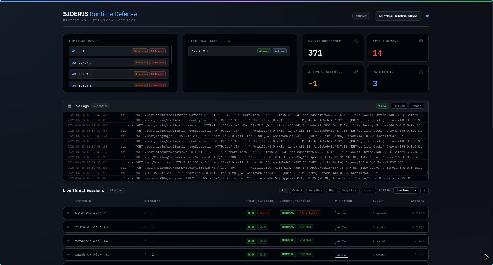
</p>

The central cockpit and primary control room of SIDERIS. It aggregates active visitor counts, real-time threat scores, active block percentages, and live telemetry feeds into a single unified workspace—perfect for leaving open on a second monitor to look busy when your boss walks past.

---

#### `02` &nbsp; Scoring & Rules Reference

<p align="center">
  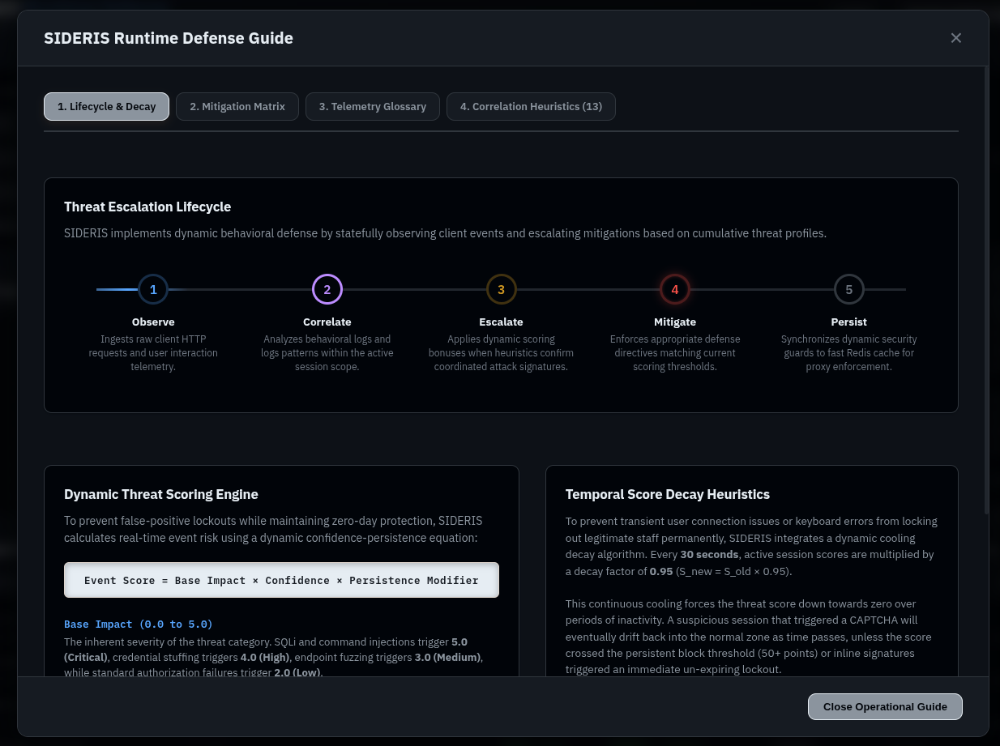
</p>

Accessed from the top header navigation. This is an interactive manual explaining the WAF's threat equations, correlation rules, and decay math—perfect bedtime reading for when you want to study the exact logic of the heuristic engine.

---

#### `03` &nbsp; Event Summary Metrics

<p align="center">
  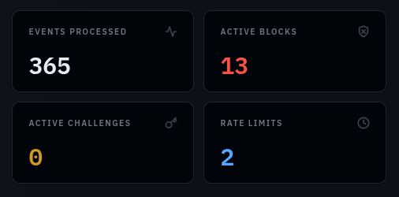
</p>

Sitting in the top row of the dashboard canvas. A high-level KPI widget showing today's deflected attacks and active blocks. It's the ultimate chart to copy-paste into your monthly report to justify your cybersecurity budget and existence.

---

#### `04` &nbsp; Top Offenders Leaderboard

<p align="center">
  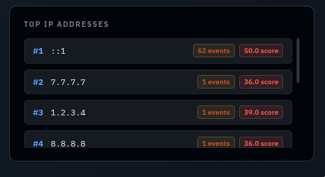
</p>

Positioned in the upper-right dashboard grid. The SIDERIS Hall of Shame. A ranked leaderboard of the most aggressive attacker subnets and scrapers that tried their best, got blocked immediately, and now have their IPs permanently memorialized.

---

#### `05` &nbsp; Dashboard Access Audit Log

<p align="center">
  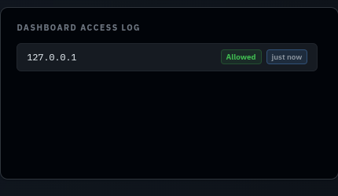
</p>

Placed in the upper metrics row. A strict self-audit panel logging every dashboard log-in attempt. SIDERIS is so paranoid it doesn't even trust you, meaning if you mistype your admin credentials, you will log yourself as a threat.

---

#### `06` &nbsp; Live Sessions Table

<p align="center">
  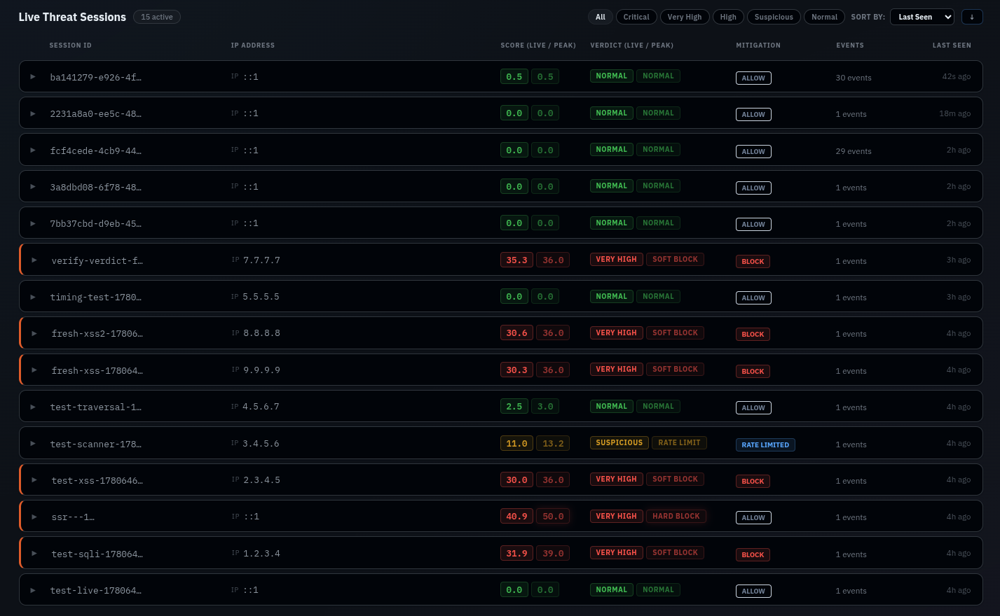
</p>

The main central table of the dashboard. A real-time grid tracking every active visitor. It color-codes sessions by risk level (green is human, red is script) so you can watch scrapers trying to brute-force your pages and giggle as their threat scores spike.

---

#### `07` &nbsp; Session Detail View

<p align="center">
  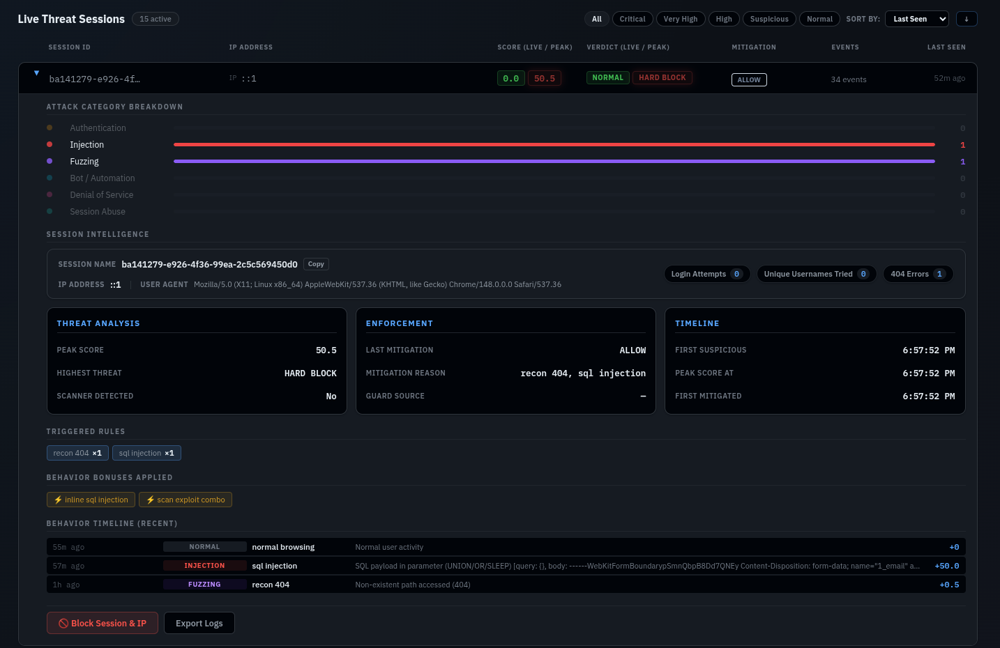
</p>

Opened by expanding any row in the center grid. The forensic investigator panel. Expand any active user to inspect their triggered correlation rules, raw event timeline, and keystroke timing distributions—complete with a massive manual ban button for when automated filtering isn't satisfying enough.

---

#### `08` &nbsp; Active Defense Registry

<p align="center">
  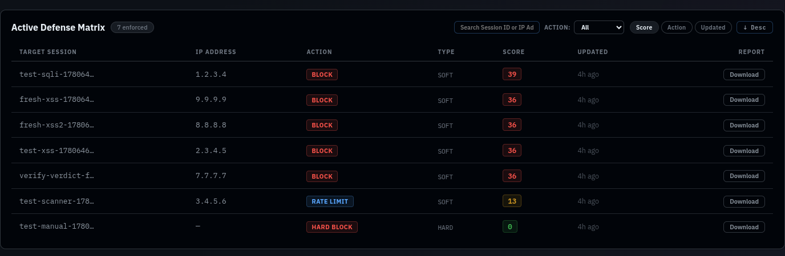
</p>

Located near the bottom half of the dashboard. A live registry of every active ban, rate-limit, and CAPTCHA challenge currently registered in Redis. If a real user accidentally gets flagged, you can grant them parole with a single click.

---

#### `09` &nbsp; Unified Log Console

<p align="center">
  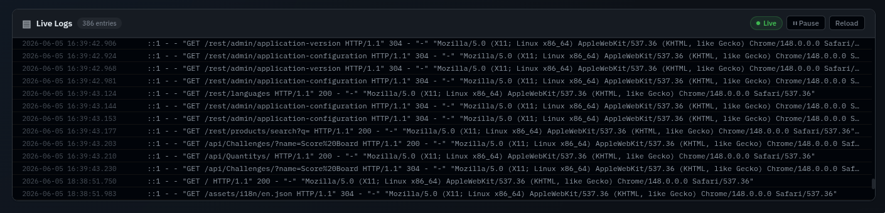
</p>

Embedded at the bottom of the dashboard. An integrated console combining stdout logs from your proxy, ingest, and detector containers. It looks like the Matrix code, except it actually contains useful information instead of green rain.

---

#### `10` &nbsp; Transparent Agent Injection

<p align="center">
  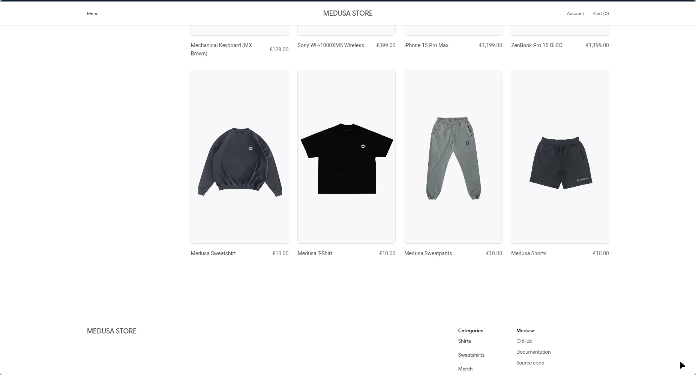
</p>

From the visitor's perspective, your site looks completely normal. Behind the scenes, SIDERIS has injected a lightweight `agent.js` into served HTML that streams behavioral telemetry in real time. No cookies. No visible UI changes. No application modification. It's like having a private investigator watch every visitor from the bushes, except it's completely legal and doesn't get tired.

---

#### `11` &nbsp; CAPTCHA Challenge

<p align="center">
  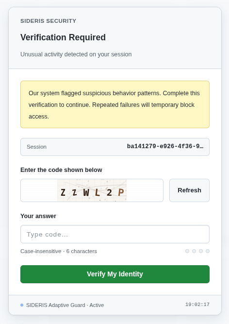
</p>

The security gate served directly to visitors in their browser. Suspected bots get hit with a CAPTCHA mid-session, trapping automated scrapers in an infinite loop of identifying traffic lights while actual humans pass right through in seconds.

---

#### `12` &nbsp; Hard Block Screen

<p align="center">
  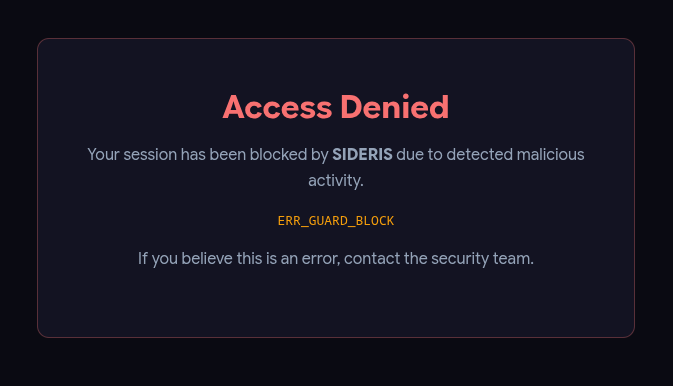
</p>

The block page shown to banned visitors. Confirmed threat actors get their TCP connections dropped at the proxy level before they ever touch your actual application server, saving your CPU cycles and database from useless queries.

<br>

<!---------------------------------------------------------------------------->

<p align="center">
  
</p>

<a id="quick-start"></a>
<br>

**Prerequisites:** Docker and Docker Compose. Nothing else needs to be installed on your host.

> [!IMPORTANT]
> SIDERIS runs as a sidecar in front of your existing application. Your application keeps running on its current port. SIDERIS takes the public-facing port.

<br>

<table>
<tr>
<td width="60px" align="center"><b>01</b></td>
<td><b>Clone the repository</b></td>
</tr>
</table>

```bash
git clone https://github.com/Ann-BT/SIDERIS.git
cd SIDERIS
```

<table>
<tr>
<td width="60px" align="center"><b>02</b></td>
<td><b>Configure — takes 30 seconds</b></td>
</tr>
</table>

```bash
cp .env.example .env
```

Open `.env` and set two values. Everything else has safe defaults.

```env
# Where your application is currently running
TARGET_URL=http://localhost:8080

# The public port SIDERIS listens on (your users hit this)
PROXY_PORT=4000
```

<table>
<tr>
<td width="60px" align="center"><b>03</b></td>
<td><b>Launch</b></td>
</tr>
</table>

```bash
docker compose up -d --build
```

Done. Your application is now protected at `http://your-server:4000`.
SOC dashboard at `http://localhost:5173` — localhost only by default.

<br>

### What's Running

```
sideris-app  (Proxy)    :4000   ◄ WAF — faces the internet
sideris-app  (Ingest)   :5000   ◄ Telemetry receiver — keep internal
sideris-app  (SOC API)  :6001   ◄ Dashboard API — keep internal
sideris-app  (SOC UI)   :5173   ◄ Dashboard UI — keep internal
sideris-redis           internal only
sideris-postgres        internal only
```

All inter-service traffic runs over an isolated Docker network. Only the ports you explicitly expose are reachable from outside.

<br>

### Recommended Production Setup

```
[Internet]
    │
    ▼ :443
[Nginx / Cloudflare]  ◄── handles TLS
    │
    ▼ :4000
[SIDERIS]             ◄── handles security logic
    │
    ▼ :8080
[Your Application]    ◄── untouched
```

For full production deployment including HTTPS, high-availability, and scaling: **[Deployment Guide](./DEPLOYMENT.md)**

<br>

<!---------------------------------------------------------------------------->

<p align="center">
  
</p>

<a id="limitations"></a>
<br>

> Every security tool has a threat model boundary. Here is SIDERIS's — stated plainly, without footnotes.

<br>

<details>
<summary><b>Not a DDoS mitigation tool</b></summary>
<br>

SIDERIS is designed for behavioral analysis of individual sessions, not volumetric flood attacks. If you're receiving millions of requests per second, you need a CDN-level solution (Cloudflare, AWS Shield) upstream of SIDERIS — not instead of it.

</details>

<details>
<summary><b>Not a network firewall</b></summary>
<br>

SIDERIS operates at the HTTP application layer. It does not inspect raw TCP/UDP traffic, provide IDS/IPS functionality, or replace <code>iptables</code> / <code>ufw</code> rules.

</details>

<details>
<summary><b>Static detection thresholds — not ML-based</b></summary>
<br>

SIDERIS uses pre-configured static rules and thresholds rather than dynamic machine learning. This eliminates warm-up delays and makes the scoring engine predictable and auditable, but it means you may need to tune sensitivity in <code>.env</code> to match your application's baseline traffic patterns.

</details>

<details>
<summary><b>False positives are possible</b></summary>
<br>

Power users, accessibility tools, and some browser extensions can produce behavioral signals that resemble automation. Default thresholds are tuned conservatively, but no behavioral system is perfect. Any affected session can be pardoned from the Active Defense Registry in seconds.

</details>

<details>
<summary><b>Single proxy process without redundancy</b></summary>
<br>

Without a load balancer, SIDERIS is a single point of failure. For mission-critical deployments, run multiple instances behind a health-checked load balancer. See <a href="./DEPLOYMENT.md">Deployment Guide</a>.

</details>

<details>
<summary><b>Behavioral telemetry requires JavaScript</b></summary>
<br>

<code>agent.js</code> requires JavaScript to run in the visitor's browser. Sessions with JS disabled fall back to request-pattern analysis only. This covers the vast majority of real traffic, but reduces detection confidence for JS-disabled clients.

</details>

<br>

> [!NOTE]
> Security is a layered problem. SIDERIS is one layer — the behavioral detection layer. It works best *alongside*, not *instead of*, TLS, proper authentication, dependency patching, and infrastructure hardening.

<br>

<!---------------------------------------------------------------------------->

<p align="center">
  
</p>

<a id="configuration"></a>
<br>

All configuration lives in `.env`. No config files to hunt down.

<div align="center">

| Variable | Default | Description |
|:---|:---|:---|
| `TARGET_URL` | `http://localhost:8080` | Your application's internal address. SIDERIS forwards clean traffic here. |
| `PROXY_PORT` | `4000` | Public-facing WAF port. This is what your users connect to. |
| `INGEST_PORT` | `5000` | Telemetry receiver. Keep internal — do not expose to the internet. |
| `DASHBOARD_PORT` | `6001` | SOC dashboard API. Keep internal. |
| `REDIS_URL` | `redis://redis:6379` | Live session state. Docker manages this automatically. |
| `POSTGRES_URL` | `postgresql://sideris:...` | Event archive. Docker manages this automatically. |
| `DASHBOARD_ALLOWED_IPS` | `127.0.0.1,::1` | IPs permitted to access the SOC dashboard. Add your own here. |

</div>

<br>

**Common configurations:**

```env
# Allow your IP on the SOC dashboard
DASHBOARD_ALLOWED_IPS=127.0.0.1,::1,203.0.113.42

# Take over port 80 directly on a VPS
TARGET_URL=http://localhost:8080
PROXY_PORT=80

# Allow an entire office network
DASHBOARD_ALLOWED_IPS=127.0.0.1,::1,192.168.1.0/24
```

For scoring threshold tuning, session TTL, and advanced options: **[Deployment Guide](./DEPLOYMENT.md)**

### Extended Reference Guides
* **[Operations & Administration Guide](./docs/ADMIN_GUIDE.md)** — Manage active bans, unban users via CLI/Redis, database maintenance, and troubleshooting.
* **[Customization & Rules Tuning Guide](./docs/CUSTOMIZATION.md)** — Details on the scoring formulas, adjusting mitigation thresholds, and writing custom WAF rules.
* **[Browser Agent Reference](./docs/AGENT_DETAILS.md)** — Client-side telemetry specifications, session synchronization mechanics, and CSP compatibility.

<br>

<!---------------------------------------------------------------------------->

<p align="center">
  
</p>

<a id="faq"></a>
<br>

<details>
<summary><b>Will SIDERIS slow down my website?</b></summary>
<br>

For most sites: negligibly. Clean requests on established sessions add ~2–4ms. Cold session lookups (new visitors) add ~8–12ms. Blocked sessions are dropped in under 1ms and never reach your app. See <a href="#performance">Performance</a> for full numbers.

</details>

<details>
<summary><b>What happens if SIDERIS itself goes down?</b></summary>
<br>

Traffic stops flowing to your application. This is a proxy — if the proxy dies, the connection dies. For production, run it behind a health-checked load balancer. See <a href="./DEPLOYMENT.md">Deployment Guide</a>.

</details>

<details>
<summary><b>What if Redis or PostgreSQL goes down?</b></summary>
<br>

SIDERIS is configured to <b>fail open</b>. If Redis encounters issues, the WAF Proxy catches the error, logs it, and falls back to routing traffic directly to your application without blocking users. Your site stays online, though behavioral scoring is paused until the database recovers.

</details>

<details>
<summary><b>Will it block my legitimate users?</b></summary>
<br>

Occasionally possible, especially for power users or accessibility tool users. Default thresholds are conservative. Any blocked session can be pardoned from the Active Defense Registry in seconds, and you can tune sensitivity directly in <code>.env</code>.

</details>

<details>
<summary><b>Does it work with HTTPS?</b></summary>
<br>

SIDERIS terminates plain HTTP. Put Nginx or Caddy in front to handle TLS, then forward to SIDERIS on port 4000. Standard reverse proxy pattern — nothing unusual about the setup.

</details>

<details>
<summary><b>Does agent.js collect personal data?</b></summary>
<br>

It collects behavioral signals only: keystroke timing <i>intervals</i>, mouse movement vectors, request patterns. It does not collect keystrokes themselves, form field content, or any personally identifiable information. You can review <code>agent.js</code> directly — it's in the repository.

</details>

<details>
<summary><b>Can I run this on shared hosting?</b></summary>
<br>

No. SIDERIS requires Docker. You need a VPS or dedicated server.

</details>

<br>

<!---------------------------------------------------------------------------->

<p align="center">
  
</p>

<br>

<div align="center">

Found a bug? Have a feature idea? Deployed this on a real site?

[](https://github.com/Ann-BT/SIDERIS/issues)
&nbsp;
[](mailto:anbt.personal@gmail.com)

</div>

<br>

---

<br>

<div align="center">

**SIDERIS** is open-source, MIT licensed.<br>
Free to use, modify, and deploy — personal projects, commercial sites, whatever.

The only thing the license doesn't cover is holding us responsible if a sufficiently<br>motivated attacker gets through anyway. Security is a process. SIDERIS is one layer of it.

<br>

*Built with genuine paranoia about web security and an unhealthy relationship with Redis Streams.*

</div>
